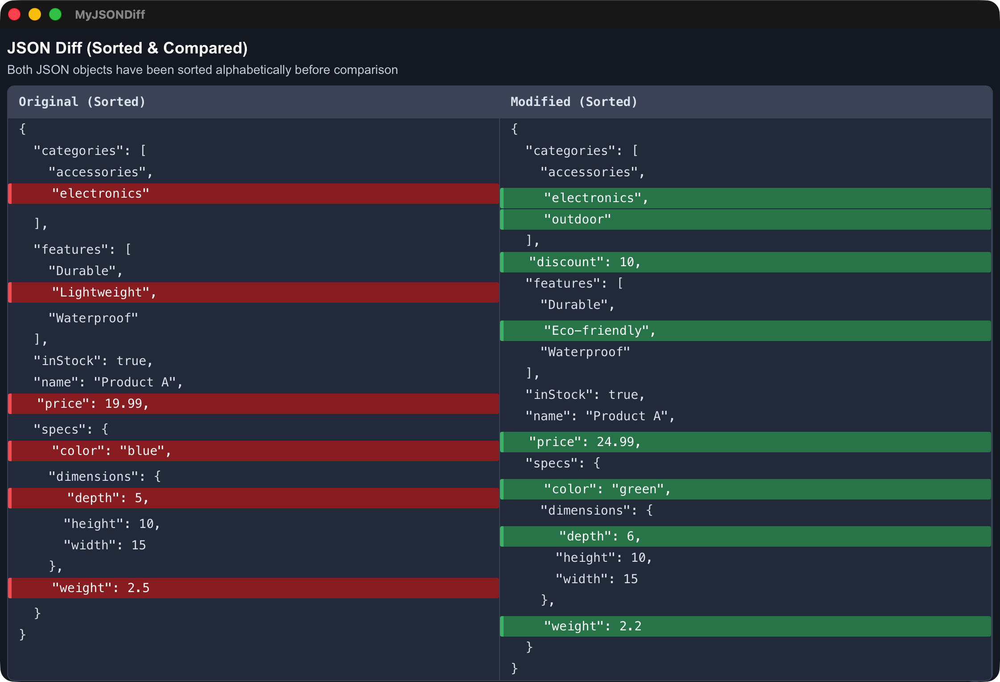

# MyJSONDiff

MyJSONDiff is a clean, fast JSON diff tool that makes it easy to compare two JSON objects side by side. It uses the jsonsortdiff approach to normalize key order before diffing, so the results focus on real changes instead of formatting noise.

## Screenshot



## Website

Official site: https://www.xnu.app/jsondiff

## Download

App Store: https://apps.apple.com/us/app/myjsondiff/id6742816661

## Features

- Side-by-side JSON editors with a clear, readable layout
- Order-insensitive comparison via alphabetized key sorting (jsonabc)
- Professional diff visualization with added/removed/changed highlights
- Handles nested objects and arrays
- Color-coded output for quick scanning
- Fully client-side processing
- Dark mode support
- Responsive design for desktop and mobile

## How It Works

1. Paste JSON A on the left
2. Paste JSON B on the right
3. Click "Compare JSON"
4. The tool sorts both objects by key order
5. A structured, side-by-side diff is generated

### Diff Legend

- **Added** (green): present on the right, missing on the left
- **Removed** (red): present on the left, missing on the right
- **Changed** (yellow): same key, different value

## Tech Stack

- Tauri 2 (desktop shell)
- Next.js 14.2 (frontend)
- React 18
- TypeScript (app + tooling)
- Tailwind CSS (styling)
- [jsonabc](https://www.npmjs.com/package/jsonabc) for key sorting
- [diff](https://www.npmjs.com/package/diff) for diff generation

## Local Development

```bash
npm install
npm run dev
```

## Contributing

Issues and pull requests are welcome.

## License

MIT

## Star History

[](https://star-history.com/#eevv/MyJSONDiff&Date)
